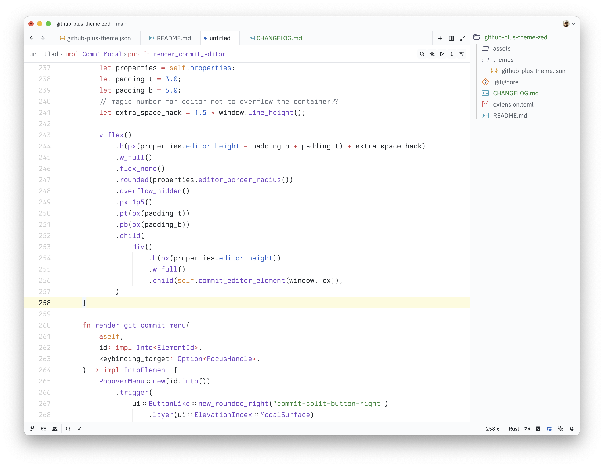
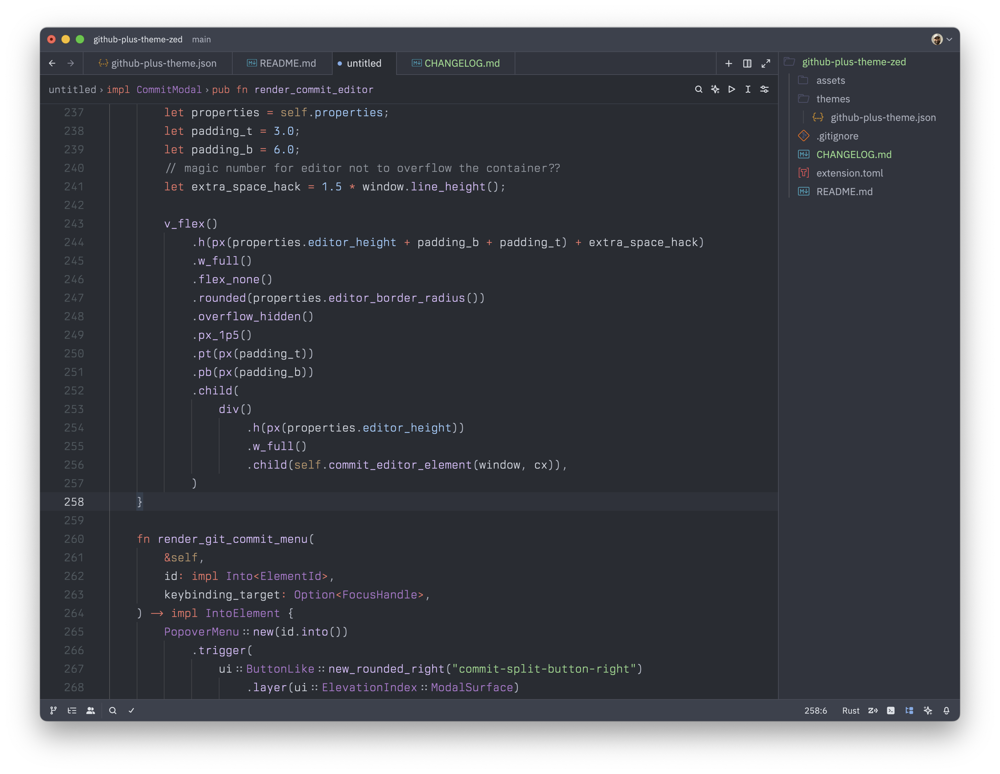

# GitHub Plus Theme for Zed

A theme for [Zed](https://zed.dev/) inspired by GitHub coloring and ported from its [VSCode counterpart](https://github.com/thenikso/github-plus-theme).

## Preview

### Light Theme

### Dark Theme

## Extras

I use this with:
- [Catppuccin Icons](https://github.com/catppuccin/zed-icons)
- `buffer_font_family`: [Berkeley Mono](https://usgraphics.com/products/berkeley-mono) (paid font)
- `buffer_font_weight` of `300`
